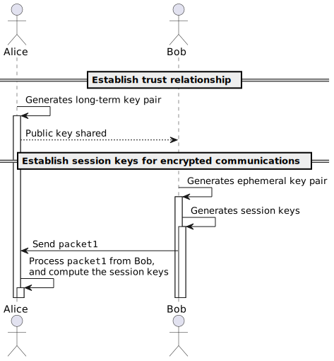
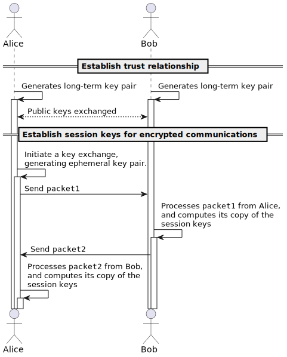

# Cryptography

## LibHydrogen

[LibHydrogen](https://github.com/jedisct1/libhydrogen) is a very lightweight, computationally efficient, cryptographic library written in C. It is designed for applications such as microcontrollers. Therefore it is ideally suited to being ported to CHERIoT. 

Whilst CHERIoT and the library's C implementation addresses the "edge" segment of the network, the core network relies on the Configured Things Platform, a software framework written in JavaScript and deployed on Nodejs. Therefore WebAssembly and the WebAssembly System Interface is utilised to execute a compiled LibHydrogen WebAssembly from the Nodejs runtime.

### Encryption

LibHydrogen exposes its [`hydro_secretbox`](https://github.com/jedisct1/libhydrogen/wiki/Secret-key-encryption) API for symmetric encryption.

To facilitate the secure exchange of symmetric session keys, LibHydrogen exposes its [`hydro_kx`](https://github.com/jedisct1/libhydrogen/wiki/Key-exchange) API for key exchange. LibHydrogen supports three means of exchanging session keys for the sending and receiving of encrypted data, named `N`, `KK` and `XX`.

> [!TIP]
> These handshake patterns are borrowed from the [Noise Protocol Framework](https://noiseprotocol.org):
>
>> The fundamental interactive patterns are named with two characters, which indicate the status of the initiator and responder’s static keys:
>>
>>The first character refers to the initiator’s static key:
>> - `N` = No static key for initiator
>> - `K` = Static key for initiator Known to responder
>> - `X` = Static key for initiator Xmitted (“transmitted”) to responder
>> - `I` = Static key for initiator Immediately transmitted to responder, despite reduced or absent identity hiding
>>
>> The second character refers to the responder’s static key:
>> - `N` = No static key for responder
>> - `K` = Static key for responder Known to initiator
>> - `X` = Static key for responder Xmitted (“transmitted”) to initiator

#### `N`

This variant is designed to anonymously send messages to a recipient using its public key.[^libhydrogenwiki]

##### Prior knowledge 
| Alice | Bob |
| - | - |
| Nothing | Alice's long-term public key |




#### `KK`

This variant is designed to exchange messages between two parties that already know each other's public key.[^libhydrogenwiki]

##### Prior knowledge 
| Alice | Bob |
| - | - |
| Bob's long-term public key | Alice's long-term public key |




#### `XX`

This is the most versatile variant, but it requires two round trips. In this variant, the Bob and Alice don't need to share any prior data. However, the peers public keys will be exchanged. Discovered public keys can then be discarded, used for authentication, or reused later with the `KK` variant.[^libhydrogenwiki]

#### Prior knowledge 
| Alice | Bob |
| - | - |
| Nothing | Nothing |


[^libhydrogenwiki]: This text is adapted from the [LibHydrogen wiki](https://github.com/jedisct1/libhydrogen/wiki).

## Configuration broker design considerations

`sfjs-crypto`, Configured Things' first approach to applying cryptographic model protections, was designed to support the following requirements:

- Digital signing
    - models signed as documents by their authors, allowing consumers to authenticate the origin of the model.
    - origin could be to a specific identity, or where a policy specifies a certificate authority, any identity whose X.509 certificate is signed by a given CA.
    - policies are encoded in a simple reverse polish binary logic: 
        ```
        (IDENTITY IDENTITY LOGICALOPERATOR)
        ...
        (ALICE BOB AND)
        ```
- Encryption
    - models encrypted in order to protect any contained secrets between author and target system.
    - the use of Diffie-Hellman Key Exchange to agree session keys between endpoints.

However, in the case of the configuration broker, rather than providing end-to-end trust between the model author and endpoint, we are seeking to provide trust between the configuration platform and endpoints, who are communicated across an untrusted message bus.

In the example use case of the CHERIoT boards being utilised within a smart metering infrastructure, it is desirable that the platform and endpoints can each sign their model updates. The platform signing infrastructure (such as IPs, domain names etc.) and billing (such as tariff, billing period) updates. 

Encryption of both pathways is also desireable, where configuration updates of behind-the-meter systems and the tariff commercials may be considered sensitive confidentially, likewise billing data from the endpoint is likely considered sensitive, and should not be open to analysis by third parties.